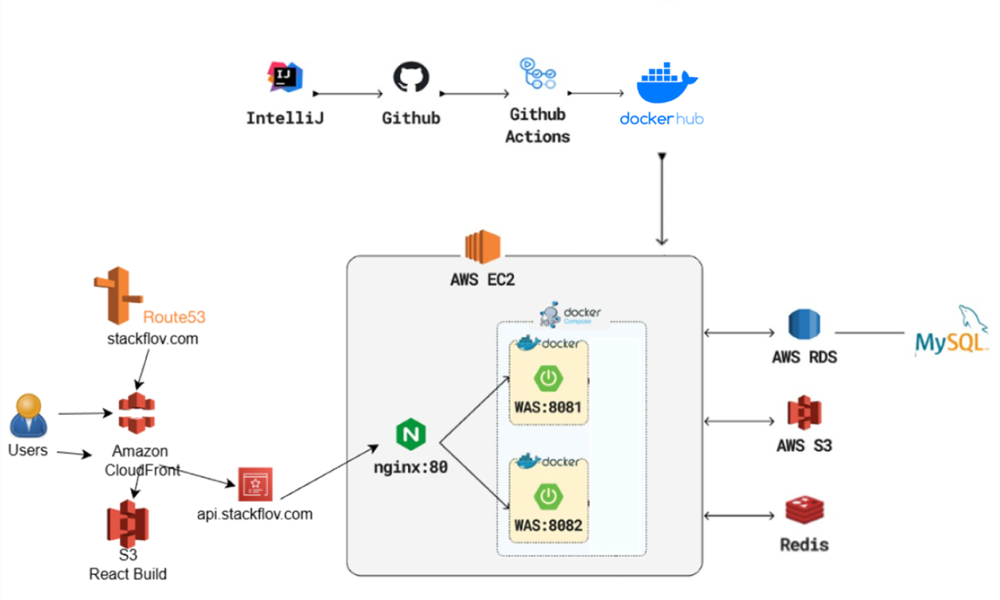

**# stackflov-docs**# StackFlov

> 자취를 준비/운영하는 학생들을 위한 커뮤니티 플랫폼  
> **자취로그(커뮤니티 게시판)** + **니방내방(지도 기반 원룸 리뷰)**

- 🔗 Service: `https://app.stackflov.com`
- 🔗 API: `https://api.stackflov.com`
- 📄 API Docs (Swagger/OpenAPI): https://api.stackflov.com/swagger-ui/index.html
- 📦 Frontend Repo: https://github.com/StackFlov/stackflov-frontend
- 🧩 Backend Repo: https://github.com/StackFlov/stackflov-backend

---

## Highlights
- **AWS 인프라 구성**: EC2 / RDS(MySQL) / S3 / CloudFront / Route53 / Nginx
- **무중단 배포**: Docker-Compose 기반 Blue/Green(8081/8082) + Nginx upstream 전환
- **인증/인가**: Spring Security + JWT + OAuth2(소셜 로그인) + Redis 토큰 관리
- **실시간 기능**: WebSocket(STOMP) 기반 채팅(또는 알림) 구조

---

## Table of Contents
- [1. 서비스 개요](#1-서비스-개요)
- [2. 핵심 기능](#2-핵심-기능)
- [3. 데모 / 링크](#3-데모--링크)
- [4. 시스템 아키텍처](#4-시스템-아키텍처)
- [5. 기술 스택](#5-기술-스택)
- [6. 배포 & 운영](#6-배포--운영)
- [7. 주요 설계 결정](#7-주요-설계-결정)
- [8. 트러블슈팅](#8-트러블슈팅)
- [9. 레포지토리](#9-레포지토리)
- [10. 로컬 실행](#10-로컬-실행)
- [11. 팀 구성 & 역할](#11-팀-구성--역할)
- [12. 로드맵](#12-로드맵)

---

## 1. 서비스 개요
### 왜 만들었나
자취 관련 정보는 커뮤니티에 흩어져 있고, 원룸 리뷰는 위치/조건(가격·옵션·주변 인프라) 맥락 없이 단편적으로 소비되는 경우가 많았습니다.  
StackFlov는 **“생활 정보 공유 + 지도 기반 리뷰 탐색”**을 한 서비스에서 해결하는 것을 목표로 했습니다.

### 무엇을 제공하나
- **자취로그**: 생활 정보/팁/질문을 빠르게 공유하는 커뮤니티
- **니방내방**: 지도 기반으로 원룸 리뷰를 조건 필터로 탐색/비교

---

## 2. 핵심 기능
### 🧾 자취로그 (Community)
- 게시글/댓글 CRUD
- 좋아요, 북마크
- 카테고리
- 마이페이지(내 글/내 활동)

### 🗺️ 니방내방 (Map-based Review)
- 지도 기반 리뷰 등록/조회
- 이미지 업로드/관리(S3)

### 🔐 인증/권한
- JWT 기반 인증/인가
- OAuth2 소셜 로그인 (Google/Kakao/Naver)
- Redis 기반 토큰/세션성 데이터 관리

### 💬 실시간
- WebSocket(STOMP) 기반 채팅/알림

---

## 3. 데모 / 링크
- Demo Video: TODO (선택)
- Screenshots: `docs/screenshots/` 참고

---

## 4. 시스템 아키텍처 (System Architecture)

### 4.1 전체 구성도
> 아래 이미지 파일을 `docs/architecture.png`로 넣고 경로만 맞추면 됩니다.

### 4.2 요청 흐름(예시)
1. 사용자가 `app.stackflov.com` 접속 → CloudFront가 정적 리소스 제공(S3)
2. 프론트가 `api.stackflov.com`으로 API 요청
3. Route53 → EC2(Nginx) → Blue/Green 백엔드 컨테이너(8081/8082)로 라우팅
4. 백엔드는 RDS(MySQL), Redis, S3와 연동
5. Nginx는 헬스체크 결과를 기준으로 Blue(8081)/Green(8082) 중 정상 인스턴스로 트래픽을 전환

---

## 5. 기술 스택 (Tech Stack)

### Frontend
- React 19
- React Router DOM v6 (SPA 라우팅)
- styled-components + Emotion (스타일링)
- MUI Icons (@mui/icons-material)
- axios (API 통신)
- Recharts (차트/통계 UI)
- WebSocket: STOMP.js + SockJS (실시간 기능 연동)
- Cookie 관리: js-cookie / react-cookie / universal-cookie

### Backend
- Java 21, Spring Boot 3.x
- Spring Security, JWT, OAuth2
- Redis, WebSocket(STOMP)
- MySQL (RDS)

### Infra / DevOps
- AWS EC2, RDS(MySQL), S3, CloudFront, Route53
- Nginx Reverse Proxy
- Docker / Docker-Compose
- GitHub Actions (CI/CD)

---

## 6. 배포 & 운영 포인트 (Deployment & Ops Highlights)
- GitHub Actions로 **빌드 → 도커 이미지 생성/푸시 → EC2 배포**까지 자동화했습니다.
- `push` 이벤트는 모든 브랜치에서 동작하며, **Docker 이미지가 커밋 SHA 태그로 빌드/푸시**됩니다.
- `master` 브랜치에 push 된 경우에만 추가로 `latest` 태그를 생성하고, **배포 Job이 실행**됩니다.
- 수동 배포를 위해 `workflow_dispatch`도 지원합니다.

**CI (Build & Push)**
1. Repository Checkout
2. JDK 21(Temurin) 설정
3. Gradle 빌드(`./gradlew build`)
4. Docker Hub 로그인(Secrets 기반)
5. Docker 이미지 빌드 및 푸시
   - 기본 태그: `sha-<commit_sha>`
   - `master` 브랜치일 때: `latest` 태그도 함께 푸시

**CD (Deploy to EC2, master only)**
1. GitHub Actions에서 EC2로 SSH 접속(appleboy/ssh-action)
2. EC2에서 Docker Hub 로그인 후 최신 이미지 pull
   - `${DOCKERHUB_USERNAME}/stackflov:latest`
3. 배포 서버(`/home/ubuntu/app`)에서 `deploy.sh` 실행
   - Docker-Compose 기반으로 컨테이너 재기동 및 Blue/Green 전환 로직을 스크립트로 관리
4. Redis는 `redis:alpine` 이미지를 함께 pull하여 운영 환경을 구성

---

## 7. 주요 설계 결정 (Key Design Decisions)

### 7.1 인증/인가 구조
- **Spring Security 기반 인증/인가**를 적용하여 인증 로직과 비즈니스 로직을 분리했습니다.
- **JWT 기반 인증**으로 API 요청을 처리합니다.
- **OAuth2 소셜 로그인(예: Google / Kakao / Naver)**을 통해 로그인/회원가입을 통합했습니다.
- **권한별 접근 제어**(예: 비로그인 제한, 사용자 권한 기반 접근)를 적용했습니다.

### 7.2 Redis 사용 목적
- 인증 과정에서 필요한 **토큰/인증 상태 데이터 저장소**로 Redis를 사용했습니다.
- DB 부하를 줄이고 빠른 검증/만료 처리가 가능하도록 구성했습니다.
  - (구체적으로 저장한 키/값 구조 및 만료 전략은 Backend Repo에 상세 정리)

### 7.3 실시간(WebSocket/STOMP)
- **WebSocket + STOMP**로 실시간 기능(채팅)을 구현했습니다.
- 프론트는 `@stomp/stompjs` + `sockjs-client`로 연결합니다.
- 메시징은 **Pub/Sub 구조**로 구성했습니다. (예: `/pub`, `/sub`)

### 7.4 이미지 업로드(S3)
- 이미지 파일은 서버 로컬에 저장하지 않고 **AWS S3에 업로드**하도록 구현했습니다.
- 업로드된 이미지의 접근 정보(예: URL 또는 Key)를 서비스 데이터와 함께 관리합니다.

---

## 8. 트러블슈팅 & 개선 사례 (Troubleshooting)

> 아래 형식으로 3~5개만 “진짜 겪은 것”을 적으면 포트폴리오 임팩트가 확 올라갑니다.

### 사례 1) Nginx SSL 설정/인증서(ACM 등) 적용 후 HTTPS 접속 문제
- **문제**: 도메인에 HTTPS를 적용하는 과정에서 인증서 적용/리다이렉트/프록시 설정이 꼬이면서 정상 접속이 안 되거나 예상치 못한 동작(리다이렉트/접속 실패)이 발생했습니다.
- **원인**: Nginx에서 SSL 적용 시 `server_name`, 인증서 경로(또는 인증서 구성), 80→443 리다이렉트, 프록시 헤더 전달 등 여러 설정이 동시에 맞아야 하는데 일부가 누락/불일치했습니다.
- **해결**:
  - Nginx의 HTTPS 서버 블록(443)과 HTTP 리다이렉트(80) 구성을 정리했습니다.
  - 리버스 프록시 환경에서 필요한 헤더(Host, X-Forwarded-Proto 등)가 전달되도록 설정을 보완했습니다.
- **배운 점**: SSL 이슈는 “인증서만”의 문제가 아니라 **도메인 매칭 + 리다이렉트 + 프록시 헤더**까지 한 세트로 맞춰야 안정적으로 해결됩니다.

### 사례 2) 프론트(app)와 백(api) 도메인 분리 후 인증/요청(CORS, 쿠키/토큰) 문제
- **문제**: `app.stackflov.com`에서 `api.stackflov.com` 호출 시 로그인 후에도 인증이 풀리거나 요청이 막히는 문제가 발생했습니다.
- **원인**: 도메인이 분리되면 브라우저 정책 때문에 **CORS 허용 설정**과 **인증 정보 전달 방식(쿠키/헤더)**이 정확히 맞아야 하는데 서버/프론트/프록시 설정 중 일부가 불일치했습니다.
- **해결**:
  - Spring Boot/Spring Security에서 CORS 정책(허용 Origin/Method/Header)을 서비스 도메인 기준으로 명확히 설정했습니다.
  - 프론트 요청(axios)과 서버 응답이 인증 정보를 일관되게 주고받도록 설정/흐름을 정리했습니다.
- **배운 점**: 도메인 분리 환경에서는 **백엔드만 고쳐서는 해결이 안 되고** 브라우저 정책까지 포함해 “프론트 요청 옵션 ↔ 서버 CORS ↔ 프록시”를 같이 맞춰야 합니다.

### 사례 3) Blue/Green 무중단 배포에서 헬스체크/전환(8081↔8082) 문제
- **문제**: Blue/Green 구조(8081/8082)에서 배포 후 트래픽 전환 과정이 기대대로 되지 않거나 헬스체크 기준이 애매해서 안정적으로 스위칭되지 않는 문제가 있었습니다.
- **원인**: 전환의 기준이 되는 **헬스체크 엔드포인트/응답 조건**과 Nginx upstream 전환 타이밍이 정확히 맞아야 하는데 초기에는 그 기준과 절차가 명확히 정리되지 않았습니다.
- **해결**:
  - “정상 서비스 가능 상태”를 판단할 헬스체크 엔드포인트를 기준으로 전환 흐름을 정리했습니다.
  - Nginx upstream 전환 및 reload가 예측 가능하게 동작하도록 배포 절차를 고정했습니다.
- **배운 점**: 무중단 배포에서 핵심은 “컨테이너가 켜짐”이 아니라 **헬스체크로 ‘Ready’를 확인하고 전환하는 운영 절차**를 만드는 것입니다.

---

## 9. 레포지토리 안내 (Repositories)
- Frontend: <FE_REPO_URL>
  - 화면/컴포넌트 구조, 빌드/배포 상세
- Backend: <BE_REPO_URL>
  - 도메인/보안/API/배포 파이프라인 상세

---

## 10. 로컬 실행 / 개발 환경 (Getting Started)

### Quick Start
> 자세한 내용은 각 레포 README를 참고하세요.
- Frontend: <FE_REPO_URL>
- Backend: <BE_REPO_URL>

(선택) 로컬에서 전체를 띄우는 docker-compose가 따로 있으면 여기에 추가

---

## 11. 팀 구성 & 역할 (Team & Role)
- 인원: 3명 (Backend 1, Frontend 1, 기획/문서 1)
- 내 역할(Backend 리드):
  - 백엔드 API 설계/구현
  - 인증/인가(JWT/OAuth2), Redis, WebSocket
  - AWS 인프라 구성 및 배포 자동화(Blue/Green, Nginx, GitHub Actions)
  - 운영 이슈 트러블슈팅 및 개선

---

## 12. 회고 & 로드맵 (Retrospective / Roadmap)
- 개선 예정:
  - 성능 최적화(쿼리/인덱스)
  - 모니터링/알림(CloudWatch, APM 등)
  - 테스트/품질(통합테스트, 부하테스트)
  - 보안 강화(레이트리밋, WAF 등)
